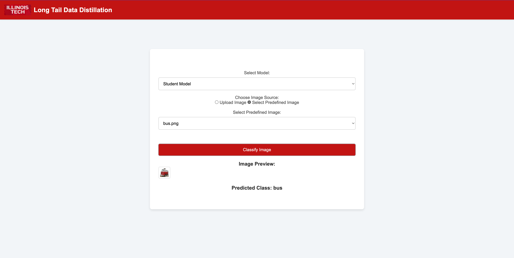

# Handling Long Tail Data Distirbutions

Long-tailed data distributions pose significant challenges in machine learning, particularly in achieving balanced model performance across both head and tail classes. In real-world scenarios, such as medical diagnosis, wildlife monitoring, and multi-modal fusion, the class imbalance inherent in long-tailed datasets often leads to over-fitting to dominant classes and poor generalization for minority classes. This study explores advanced learning strategies tailored for long-tailed data, emphasizing the use of Decoupled Loss functions designed specifically for head and tail classes. Moreover, we analyze the disadvantages of current methods, particularly their lack of focus on addressing shared visual patterns across head and tail classes. Some images in both classes contain similar patches that do not contribute effectively to model performance. To address this, we propose a Patch-Based Decoupled Student-Teacher Knowledge Distillation framework, which selectively refines patch-level feature learning and leverages separate optimization strategies for head and tail classes. Our approach is evaluated on benchmark datasets such as CIFAR-10-LT, CIFAR-100-LT, Stanford-Cars-LT and Caltech-256-LT, demonstrating improved in classification accuracy for tail classes while preserving overall model reliability. This study provides valuable insights into different challenges and the possible way around towards mitigating the challenges of long-tailed distributions, advancing the robustness and fairness of machine learning systems in real-world applications.
This project is a web-based image classification tool that utilizes a Teacher-Student model on long tailed data. The app allows users to classify images by either uploading their own images or selecting from a set of predefined images.

## Features

* **Model Selection**: Choose between the "Teacher Model" and "Student Model".
* **Image Input**: Toggle between uploading an image or selecting from predefined images.
* **Preview**: View a preview of the selected image before classification.
* **Result**: Display the predicted class of the image.

## Demo


Wrong Prediction by Teacher Model

Right Prediction by Student Model
 
## Prerequisites

* **Python 3.6 or above**
* **Flask web framework**
* **PyTorch for model inference**
* **Torchvision for model and transformation utilities**

## Installation

1. **Clone the repository:**

    ```bash
    git clone https://github.com/nikhiliit/handling_long_tailed_data
    cd handling_long_tailed_data
    ```

2. **Create a virtual environment (recommended):**

    ```bash
    python3 -m venv venv
    source venv/bin/activate  # On Windows: venv\Scripts\activate
    ```

3. **Install the dependencies:**

    ```bash
    pip install -r requirements.txt
    ```

3. **Training the models:**
    Note :- Most of the datasets used in this experiments can be directly fetch fro the Pytroch library.
   Step 1 : Train the teacher model
    ```bash
    cd ./Proposed_Model
    python teacher.py
    ```
    Step 2 : Do Knowledge Distillation for a Student Model. Update the teacher model directory in the code line 508.
    ```bash
    cd ./Proposed_Model
    python student.py
    ```
    
5. **Check your saved models:**
    
    After training you can put your `teacher_model.pth` and `student_model.pth` files in a `saved_model` directory in the project root.

## Predefined Images

Add predefined images in the `static/images` directory. Ensure images are in `.png`, `.jpg`, or `.jpeg` format.

## Add a Logo

Place your logo as `logo.png` in the `static` directory.

## Usage

1. **Run the Flask server:**

    ```bash
    python app.py
    ```

2. **Access the Web App:**

    Open your browser and navigate to [http://127.0.0.1:5000](http://127.0.0.1:5000).

## Project Structure

```plaintext
image-classification-flask/
├── app.py                 # Main application script
├── saved_model/           # Folder for model .pth files
├── static/
│   ├── images/            # Folder for predefined images
│   ├── logo.png           # App logo
│   └── styles.css         # Styles for the app
├── templates/
│   └── index.html         # HTML template
├── requirements.txt       # List of dependencies
└── README.md              # Project documentation
